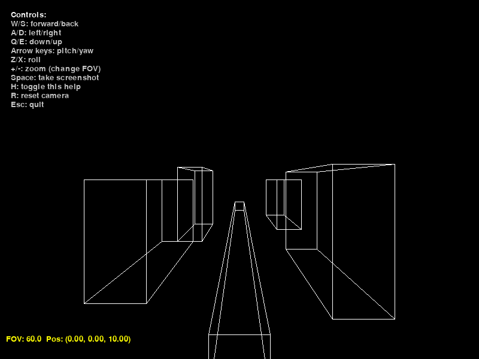
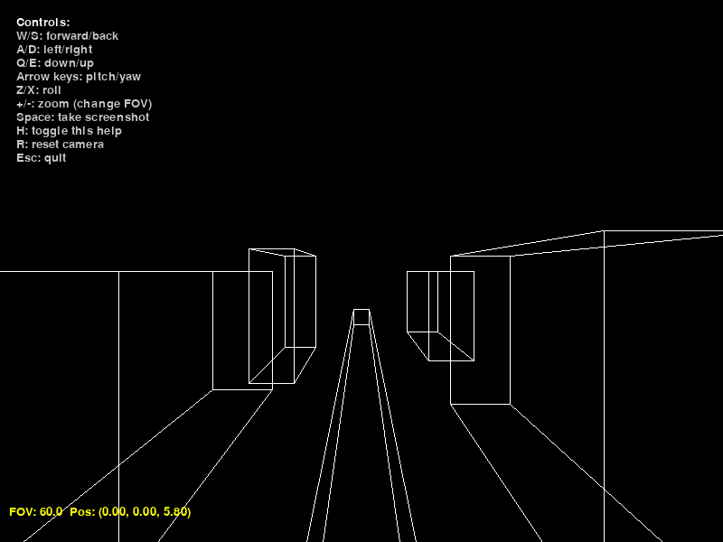
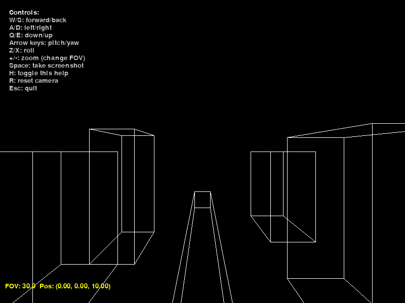
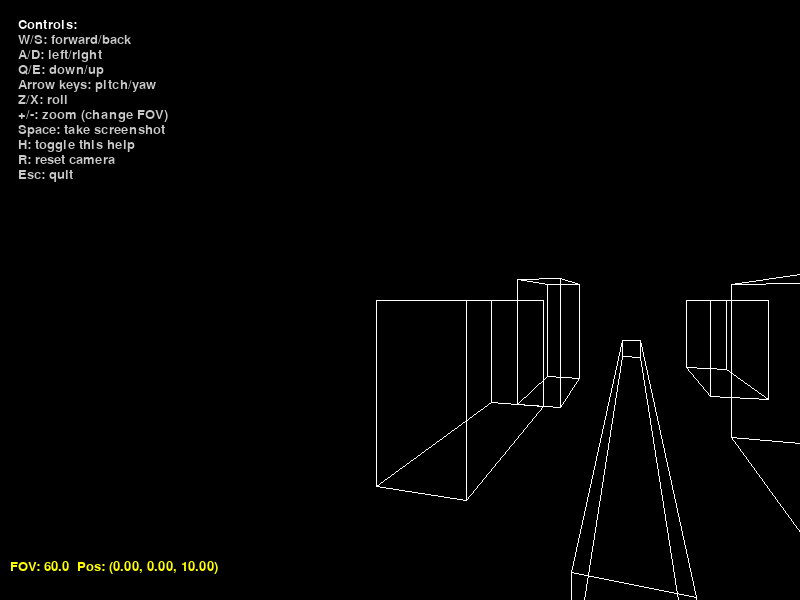
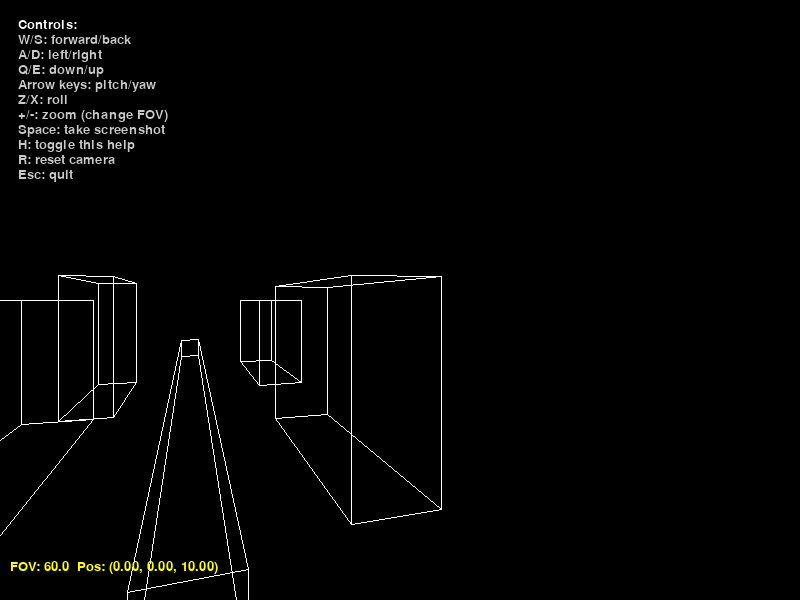
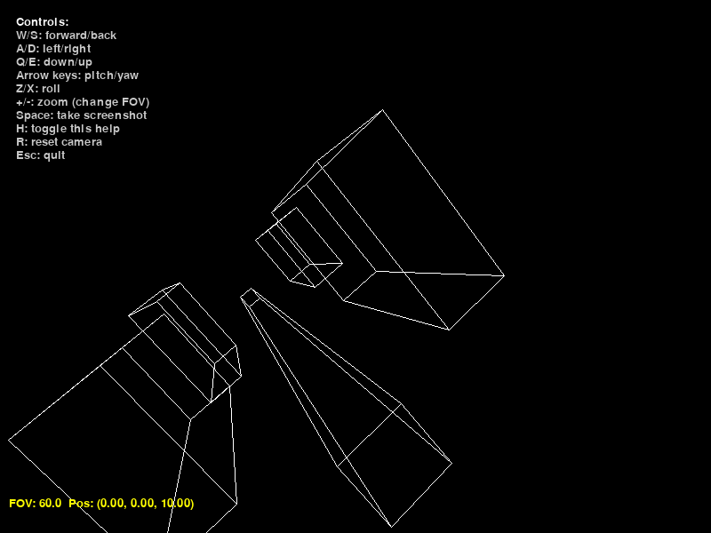
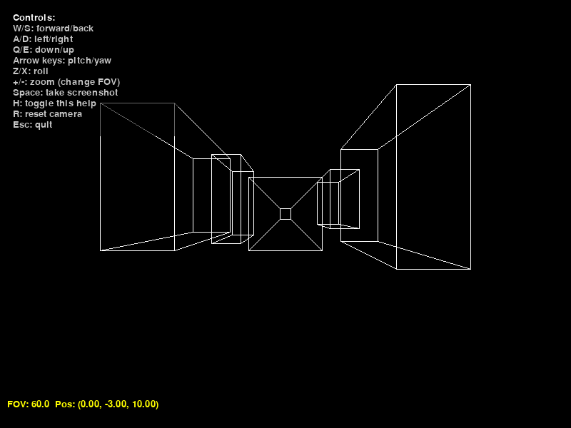

# Sprawozdanie z Zadania Projektowego: Wirtualna Kamera


**Kurs:**  
Grafika komputerowa i wizualizacja (2025Z)  

**Autor:**  
Łukasz Krajewski, nr albumu: 335077

**Data:**  
poniedziałek, 13 października 2025  

---

## Spis treści

1. Wstęp  
2. Opis realizacji zadania  
3. Instrukcja obsługi programu  
4. Opis testów i wyniki  
5. Opinie na temat uzyskanego efektu  
6. Kod źródłowy  

---

## 1. Wstęp

Niniejsze sprawozdanie dotyczy realizacji Zadania 1: Wirtualna kamera, w ramach projektu z przedmiotu Grafika komputerowa i wizualizacja. Zadanie polega na stworzeniu programu symulującego aparat fotograficzny, umożliwiającego translację w przestrzeni obserwatora (góra-dół, lewo-prawo, przód-tył), obrót wokół trzech osi związanych z kamerą oraz zmianę ogniskowej (kąta widzenia, zoom). Scena jest prosta, składająca się z prostopadłościanów imitujących ulicę z budynkami po lewej i prawej stronie, renderowana w trybie krawędziowym bez eliminacji zasłaniania.

Program został zaimplementowany w języku Python z wykorzystaniem biblioteki Pygame do obsługi okna i rysowania prymitywów 2D, oraz NumPy do operacji macierzowych. Kluczowe elementy, takie jak przekształcenia geometryczne, macierz widoku, projekcja perspektywiczna i obsługa kwaternionów, zostały napisane samodzielnie, bez użycia gotowych rozwiązań 3D. Implementacja opiera się na wiedzy z podręcznika kursu. Kod źródłowy programu znajduje się na końcu sprawozdania.

Celem sprawozdania jest opis działania programu, instrukcja obsługi oraz prezentacja testów z zrzutami ekranu, pokazujących poprawność realizacji zadania graficznego. Testy zostały dobrane tak, aby zweryfikować wszystkie wymagane operacje kamery dla charakterystycznych przypadków, z uzasadnieniem ich wyboru.

---

## 2. Opis realizacji zadania

Program realizuje wirtualną kamerę zgodnie z wymaganiami: umożliwia zmianę położenia, orientacji i kąta widzenia, z renderingiem sceny 3D na ekranie 2D. Scena składa się z pięciu prostopadłościanów: czterech imitujących budynki (po dwa po lewej i prawej stronie) oraz jednego jako reprezentacja drogi.

### Kluczowe komponenty:
- **Klasa Quaternion**: Obsługuje rotacje za pomocą kwaternionów. Implementuje mnożenie kwaternionów, normalizację i konwersję na macierz rotacji 3x3, co pozwala unikać problemów z gimbal lock w rotacjach 3D.
- **Klasa Vector3**: Reprezentuje punkty w współrzędnych jednorodnych [x, y, z, 1].
- **Klasa Cuboid**: Definiuje prostopadłościany z wierzchołkami i krawędziami.
- **Klasa Camera**: Zarządza pozycją kamery, orientacją (kwaternion) i FOV. Metoda `translate` wykonuje translację w lokalnym układzie, `rotate` dodaje lokalne rotacje wokół osi, a `get_view_matrix` oblicza macierz widoku jako odwrotność transformacji kamery.
- **Projekcja perspektywiczna**: Funkcja `perspective_matrix` tworzy macierz projekcji na podstawie FOV, aspektu, near i far (standardowa formuła, zgodna z literaturą zalecaną w podręczniku, np. Hughes et al.).
- **Rendering**: W pętli głównej transformowane są wierzchołki, wykonywany jest podział perspektywiczny (x/w, y/w), a linie rysowane za pomocą `pygame.draw.line`. Dodano prosty clipping (w > 0).

Program jest interaktywny, z HUD pokazującym FOV i pozycję, menu pomocy (klawisz H) oraz funkcją zrzutów ekranu (Space) z timestampem. Reset kamery (R) przywraca stan początkowy.

Realizacja skupia się na zadaniu graficznym: poprawnym rzutowaniu i transformacjach, bez dodatkowych efektów jak ostrość (zgodnie z zadaniem).

---

## 3. Instrukcja obsługi programu

Program uruchamia się poprzez wykonanie pliku `virtual_camera.exe` (po kompilacji przez Niutka). Okno ma rozmiar 800x600 pikseli.

### Sterowanie:
- **Translacja (lokalna):**  
  - W/S: przód/tył  
  - A/D: lewo/prawo  
  - Q/E: dół/góra  
- **Rotacja (lokalna):**  
  - Strzałki lewo/prawo: yaw (obrót poziomy)  
  - Strzałki góra/dół: pitch (obrót pionowy)  
  - Z/X: roll (obrót wzdłuż osi)  
- **Zoom:**  
  - + / -: zmniejsz/zwiększ FOV (kąt widzenia)  
- **Inne:**  
  - H: przełącz menu pomocy  
  - R: reset kamery do stanu początkowego  
  - Space: zrób zrzut ekranu (zapisuje PNG z timestampem w folderze programu)  
  - Esc: wyjście  

HUD na dole pokazuje bieżące FOV i pozycję kamery. Menu pomocy wyświetla listę sterowania.

---

## 4. Opis testów i wyniki

Testy zostały zaprojektowane, aby zweryfikować poprawność wszystkich operacji kamery dla charakterystycznych przypadków. Wybrano je, ponieważ:
- Pokazują różnicę między zoomem (zmiana FOV) a translacją (zmiana perspektywy).  
- Demonstrują rotacje wokół różnych osi, w tym złożone (np. roll, który jest rzadziej używany).  
- Używają sceny z głębią (budynki w perspektywie), co pozwala ocenić distortions i clipping.  
- Zawierają stan początkowy i reset, aby zapewnić powtarzalność.  

Każdy test zawiera opis, uzasadnienie, zrzut ekranu i wnioski. Zrzuty wykonano za pomocą funkcji Space w programie.

### Test 1: Stan początkowy (default view)  
Uzasadnienie: Weryfikuje poprawne inicjalne rzutowanie sceny (pozycja (0,0,10), FOV=60°). Powinno pokazywać symetryczną ulicę z budynkami po bokach.  
  
Wynik: Scena renderowana poprawnie, perspektywa zgodna z oczekiwaniami – budynki maleją w głębi.

### Test 2: Translacja przód (forward)  
Uzasadnienie: Sprawdza lokalną translację wzdłuż osi Z; budynki powinny rosnąć, perspektywa się zmieniać (nie jak zoom). Przesunięto o kilka jednostek do przodu.  
  
Wynik: Poprawne zbliżenie; krawędzie budynków rozchodzą się, co potwierdza prawidłową projekcję.

### Test 3: Zmiana FOV (zoom in)  
Uzasadnienie: Weryfikuje różnicę od translacji; zmniejszenie FOV do 30° powinno "powiększyć" obiekty bez zmiany perspektywy (brak distortion jak w ruchu).  
  
Wynik: Obiekty większe, ale proporcje zachowane – matches teoria z podręcznika.

### Test 4: Rotacja yaw (pozioma)  
Uzasadnienie: Obrót wokół osi Y o około 34°; scena powinna się obrócić, zmieniając plan w lewo lub prawo. Testuje kwaterniony w złożonych rotacjach.  

 
Wynik: Płynny obrót bez artefaktów; budynki przesuwają się poprawnie.

### Test 5: Rotacja pitch i roll (złożona)  
Uzasadnienie: Obrót pitch o kilka stopni i roll o około 40°; sprawdza unikanie gimbal lock dzięki kwaternionom.  
  
Wynik: Scena obrócona bez utraty osi; poprawna orientacja.

### Test 6: Translacja góra-dół i reset  
Uzasadnienie: Przesunięcie w dół; weryfikuje lokalną translację Y i powrót do default.  
  
Wynik: Poprawne przesunięcie; reset przywraca stan, co potwierdza brak błędów akumulacji.

---

## 5. Opinie na temat uzyskanego efektu

Efekt odpowiada teorii z podręcznika: kwaterniony zapewniają płynne rotacje, a macierze widoku/projekcji dają realistyczną perspektywę.Wireframe wygląda prosto, ale dobrze demonstruje operacje; brak cieni/tekstur czyni go mniej realistycznym, co jest zgodne z uproszczoną sceną. Manipulacja FOV vs. translacja pokazuje różnice w distortion, co jest edukacyjnie wartościowe. Ogólnie, program spełnia zadanie.

---

## 6. Kod źródłowy

Poniżej pełny kod źródłowy:

```python
import pygame
import numpy as np
import sys
import math
import os
import datetime


# klasa Quaternion (z podrecznika 4.8: q = s + i x + j y + k z)
class Quaternion:
    def __init__(self, s=1.0, v=np.zeros(3)):
        self.s = s
        self.v = v
    def __mul__(self, other):
        # multiplikacje
        s1, v1 = self.s, self.v
        s2, v2 = other.s, other.v
        s = s1 * s2 - np.dot(v1, v2)
        v = s1 * v2 + s2 * v1 + np.cross(v1, v2)
        return Quaternion(s, v)
    def conjugate(self):
        return Quaternion(self.s, -self.v)
    def normalize(self):
        norm = np.sqrt(self.s**2 + np.dot(self.v, self.v))
        if norm > 0:
            self.s /= norm
            self.v /= norm
    def to_rotation_matrix(self):
        s, x, y, z = self.s, self.v[0], self.v[1], self.v[2]
        return np.array([
            [1 - 2*y**2 - 2*z**2, 2*x*y - 2*s*z, 2*x*z + 2*s*y],
            [2*x*y + 2*s*z, 1 - 2*x**2 - 2*z**2, 2*y*z - 2*s*x],
            [2*x*z - 2*s*y, 2*y*z + 2*s*x, 1 - 2*x**2 - 2*y**2]
        ])

# klasa wektora
class Vector3:
    def __init__(self, x, y, z):
        self.data = np.array([x, y, z, 1.0])

# klasa kuboidu
class Cuboid:
    def __init__(self, pos, size):
        half = np.array(size) / 2
        offsets = [-1, 1]
        self.vertices = [Vector3(pos[0] + ox * half[0], pos[1] + oy * half[1], pos[2] + oz * half[2]).data
                         for ox in offsets for oy in offsets for oz in offsets]
        self.edges = [(0,1), (1,3), (3,2), (2,0), (4,5), (5,7), (7,6), (6,4), (0,4), (1,5), (2,6), (3,7)]

# klasa kamery
class Camera:
    def __init__(self, pos=(0, 0, 10), fov=60.0):
        # pozycja powinna używać klasy zmiennej float dtype
        self.pos = np.array(pos, dtype=float)
        self.quat = Quaternion()
        self.fov = fov 
    def rotate(self, axis, angle_deg):
        angle_rad = math.radians(angle_deg / 2)
        s = math.cos(angle_rad)
        v = math.sin(angle_rad) * axis / np.linalg.norm(axis)
        delta = Quaternion(s, v)
        delta.normalize()
        self.quat = delta * self.quat
        self.quat.normalize()
    def translate(self, delta_local):
        # Get local directions from rotation matrix (book 4.8)
        rot_mat = self.quat.to_rotation_matrix()
        delta_world = rot_mat @ delta_local
        self.pos += delta_world
    def get_view_matrix(self):
        # View = inverse(camera world) = inverse(R * T) = T^{-1} * R^{-1}
        # R^{-1} = transpose(R) since orthogonal
        rot_mat3 = self.quat.to_rotation_matrix().T  # Inverse rotation (3x3)
        # Build full 4x4 view matrix: [R^T  -R^T * pos; 0 1]
        view = np.eye(4, dtype=float)
        view[:3, :3] = rot_mat3
        view[:3, 3] = -rot_mat3 @ self.pos
        return view


def perspective_matrix(fov, aspect, near=0.1, far=100.0):
    f = 1.0 / math.tan(math.radians(fov / 2))
    return np.array([
        [f / aspect, 0, 0, 0],
        [0, f, 0, 0],
        [0, 0, (far + near) / (near - far), 2 * far * near / (near - far)],
        [0, 0, -1, 0]
    ])

# główny program
pygame.init()
width, height = 800, 600
screen = pygame.display.set_mode((width, height))
pygame.display.set_caption("Virtual Camera - Zadanie 1")
clock = pygame.time.Clock()
font = pygame.font.SysFont(None, 20)
help_visible = True
screenshot_msg = ""
msg_timer = 0.0
camera = Camera(pos=(0, 0, 10), fov=60.0)

cuboids = [
    Cuboid((-4, -2, -5), (2, 4, 10)),
    Cuboid((-4, -2, -20), (2, 6, 10)),
    Cuboid((4, -2, -5), (2, 5, 10)),
    Cuboid((4, -2, -20), (2, 4, 10)),
    Cuboid((0, -3, -10), (1, 1, 30))
]
running = True
while running:
    for event in pygame.event.get():
        if event.type == pygame.QUIT:
            running = False
        if event.type == pygame.KEYDOWN:
            if event.key == pygame.K_ESCAPE:
                running = False
            if event.key == pygame.K_h:
                help_visible = not help_visible
            if event.key == pygame.K_r:
                camera.pos = np.array((0.0, 0.0, 10.0), dtype=float)
                camera.quat = Quaternion()
                camera.fov = 60.0
            if event.key == pygame.K_SPACE:
                try:
                    folder = os.path.dirname(os.path.abspath(__file__))
                    ts = datetime.datetime.now().strftime('%Y%m%d_%H%M%S')
                    filename = f"screenshot_{ts}.png"
                    path = os.path.join(folder, filename)
                    pygame.image.save(screen, path)
                    screenshot_msg = f"Saved: {filename}"
                    msg_timer = 2.5
                except Exception as e:
                    screenshot_msg = f"Save failed: {e}"
                    msg_timer = 3.0
    keys = pygame.key.get_pressed()
    move_speed = 0.2
    rot_speed = 2.0
    fov_speed = 5.0
    forward = np.array([0, 0, -move_speed]) if keys[pygame.K_w] else np.array([0, 0, move_speed]) if keys[pygame.K_s] else np.zeros(3)
    right = np.array([move_speed, 0, 0]) if keys[pygame.K_d] else np.array([-move_speed, 0, 0]) if keys[pygame.K_a] else np.zeros(3)
    up = np.array([0, move_speed, 0]) if keys[pygame.K_e] else np.array([0, -move_speed, 0]) if keys[pygame.K_q] else np.zeros(3)
    camera.translate(forward + right + up)
    if keys[pygame.K_LEFT]: camera.rotate(np.array([0,1,0]), -rot_speed)
    if keys[pygame.K_RIGHT]: camera.rotate(np.array([0,1,0]), rot_speed)
    if keys[pygame.K_UP]: camera.rotate(np.array([1,0,0]), -rot_speed)
    if keys[pygame.K_DOWN]: camera.rotate(np.array([1,0,0]), rot_speed)
    if keys[pygame.K_z]: camera.rotate(np.array([0,0,1]), -rot_speed)
    if keys[pygame.K_x]: camera.rotate(np.array([0,0,1]), rot_speed)
    if keys[pygame.K_PLUS] or keys[pygame.K_KP_PLUS]: camera.fov = max(10, camera.fov - fov_speed)
    if keys[pygame.K_MINUS] or keys[pygame.K_KP_MINUS]: camera.fov = min(120, camera.fov + fov_speed)
    # Rendering
    screen.fill((0, 0, 0))
    proj = perspective_matrix(camera.fov, width / height)
    view = camera.get_view_matrix()
    for cub in cuboids:
        for edge in cub.edges:
            v1 = proj @ (view @ cub.vertices[edge[0]])
            v2 = proj @ (view @ cub.vertices[edge[1]])
            if v1[3] > 0 and v2[3] > 0:
                p1 = (int(width / 2 + (v1[0] / v1[3]) * (width / 2)), int(height / 2 - (v1[1] / v1[3]) * (height / 2)))
                p2 = (int(width / 2 + (v2[0] / v2[3]) * (width / 2)), int(height / 2 - (v2[1] / v2[3]) * (height / 2)))
                pygame.draw.line(screen, (255, 255, 255), p1, p2)
    # help menu
    if help_visible:
        lines = [
            "Controls:",
            "W/S: forward/back",
            "A/D: left/right",
            "Q/E: down/up",
            "Arrow keys: pitch/yaw",
            "Z/X: roll",
            "+/-: zoom (change FOV)",
            "Space: take screenshot",
            "H: toggle this help",
            "R: reset camera",
            "Esc: quit"
        ]
        padding = 8
        line_height = font.get_linesize()
        box_w = 240
        box_h = padding * 2 + line_height * len(lines)
        surf = pygame.Surface((box_w, box_h), flags=pygame.SRCALPHA)
        surf.fill((0, 0, 0, 150))
        for i, txt in enumerate(lines):
            color = (255, 255, 255) if i == 0 else (200, 200, 200)
            txt_surf = font.render(txt, True, color)
            surf.blit(txt_surf, (padding, padding + i * line_height))
        screen.blit(surf, (10, 10))
    status = f"FOV: {camera.fov:.1f}  Pos: ({camera.pos[0]:.2f}, {camera.pos[1]:.2f}, {camera.pos[2]:.2f})"
    stat_surf = font.render(status, True, (255, 255, 0))
    screen.blit(stat_surf, (10, height - 40))

    if msg_timer > 0.0 and screenshot_msg:
        msg_surf = font.render(screenshot_msg, True, (0, 255, 0))
        screen.blit(msg_surf, (width // 2 - msg_surf.get_width() // 2, 10))
    pygame.display.flip()
    ms = clock.tick(60)
    if msg_timer > 0.0:
        msg_timer -= ms / 1000.0
        if msg_timer <= 0.0:
            screenshot_msg = ""
            msg_timer = 0.0
pygame.quit()
sys.exit()
```